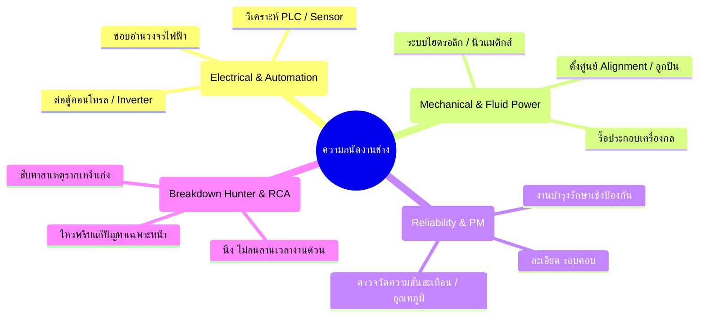

# แบบประเมินและทดสอบความถนัดงานช่าง (Technician Aptitude & Strengths Assessment)
**สำหรับ: หัวหน้าช่างใช้ประเมินลูกทีม หรือให้ช่างทำแบบทดสอบเพื่อค้นหาจุดเด่นเฉพาะตัว**

---

## 4 เส้นทางความถนัดหลักของช่างซ่อมบำรุง (4 Technician Archetypes)

---

## ส่วนที่ 1: แบบทดสอบสถานการณ์จำลอง (12 ข้อ ค้นหาความถนัด)
*คำชี้แจง: ให้ลูกน้องเลือกว่าในแต่ละสถานการณ์ "ชอบทำหรือถนัดทำข้อใดมากที่สุด" (เลือกเพียงข้อเดียวต่อ 1 สถานการณ์)*

### ข้อ 1: เมื่อเห็นเครื่องจักรใหม่เพิ่งถูกติดตั้ง สิ่งแรกที่คุณอยากเข้าไปดูหรือศึกษาคืออะไร?
- **[A]** แผงตู้ควบคุมไฟฟ้า, PLC, อินเวอร์เตอร์ และสายสัญญาณเซนเซอร์
- **[B]** ชุดขับเคลื่อนมอเตอร์, เฟืองเกียร์, สายพาน, ปั๊ม และกระบอกสูบ
- **[C]** คู่มือการบำรุงรักษา (Manual), แผนการอัดจารบี และจุดตรวจเช็กประจำวัน
- **[D]** ขั้นตอนการทำงานจริงของเครื่อง และจุดที่มีโอกาสจะติดขัดหรือพังง่ายที่สุด

### ข้อ 2: เวลาว่างที่ไม่มีงานซ่อมด่วน คุณชอบใช้เวลาไปกับเรื่องไหนมากที่สุด?
- **[A]** ศึกษาวงจรไฟฟ้า (Wiring Diagram) หรือหัดเขียนโค้ด PLC/ดูค่าพารามิเตอร์
- **[B]** ถอดล้างทำความสะอาดอะไหล่เก่า, หัดตั้งศูนย์ Alignment หรือฝึกรื้อปั๊ม/กระบอกลม
- **[C]** เดินตรวจเช็กเครื่องตามไลน์, สังเกตเสียงผิดปกติ, วัดความร้อน และจดบันทึกค่า
- **[D]** คิดค้นเครื่องมือพิเศษ หรือหาวิธีดัดแปลงจุดที่พังบ่อยให้แข็งแรงขึ้น

### ข้อ 3: เมื่อไลน์ผลิตหยุดกะทันหัน ไฟเตือนสีแดงกะพริบ เครื่องนิ่งสนิท คุณจะเริ่มลงมืออย่างไร?
- **[A]** ไปเปิดตู้ไฟ เช็กไฟสถานะของ PLC/รีเลย์ และเอาโอห์มมิเตอร์มาวัดสัญญาณ
- **[B]** เข้าไปดูส่วนที่มีการเคลื่อนไหว ลองขยับเพลา ตรวจดูว่ามีชิ้นส่วนกลไกติดขัดหรือขัดลำกล้องหรือไม่
- **[C]** ตรวจสอบประวัติการบำรุงรักษาครั้งล่าสุด เช็กระดับน้ำมันหล่อลื่นและแรงดันลม
- **[D]** สอบถามพนักงานคุมเครื่องทันทีว่า "ก่อนเครื่องหยุดเกิดอาการอะไร มีเสียงหรือกลิ่นไหม" แล้วตั้งสมมติฐานทันที

### ข้อ 4: เครื่องมือชิ้นโปรดที่คุณหยิบใช้บ่อยและมั่นใจที่สุดคืออะไร?
- **[A]** มัลติมิเตอร์ (Digital Multimeter), คีมแอมป์, ไขควงเช็กไฟ
- **[B]** ประแจทอร์ค, ตัวดึงมู่เล่ย์/ลูกปืน (Puller), เวอร์เนียร์คาลิปเปอร์, ฟิลเลอร์เกจ
- **[C]** ปืนยิงอุณหภูมิอินฟราเรด, เครื่องวัดการสั่นสะเทือน (Vibration Meter), กระบอกอัดจารบี
- **[D]** ไฟฉายคาดหัว, ประแจรวมครบชุด, เครื่องมือดัดแปลงเฉพาะตัว

### ข้อ 5: ถ้าหัวหน้ามอบหมายโปรเจกต์พิเศษให้ งานแบบไหนที่คุณทำแล้วมีความสุขที่สุด?
- **[A]** ปรับปรุงระบบควบคุมเครื่องเก่าให้เป็นอัตโนมัติ ติดตั้งเซนเซอร์กันคนเข้าจุดอันตราย
- **[B]** โอเวอร์ฮอล (Overhaul) เครื่องจักรเก่าทั้งตัว รื้อลูกปืน ล้างเกียร์ ประกอบใหม่ให้เหมือนของใหม่
- **[C]** ออกแบบแผนและขั้นตอนมาตรฐานการบำรุงรักษา (WI) ของโรงงานใหม่ให้มีระเบียบ
- **[D]** ตั้งทีมเฉพาะกิจแก้ปัญหาเครื่องจักรอันดับหนึ่งที่ชอบเสียบ่อยให้ลดเวลาหยุดลงให้ได้

### ข้อ 6: จุดแข็งที่คุณคิดว่าตัวเองโดดเด่นกว่าเพื่อนในทีมคืออะไร?
- **[A]** ความจำเรื่องวงจร อ่านแบบลายวงจรเข้าใจได้เร็วกว่าคนอื่น
- **[B]** ทักษะทางช่างกล งานฝีมือ การใช้ค้อน สกัด ตะไบ และจับฟีลลิ่งระยะหลวมคลอนได้แม่นยำ
- **[C]** ความละเอียดรอบคอบ ไม่ปล่อยผ่านจุดเล็กๆ มีวินัยทำตามขั้นตอนสม่ำเสมอ
- **[D]** ความกล้าตัดสินใจในสถานการณ์คับขัน ไม่ตื่นตระหนกเวลามีคนมายืนกดดัน

### ข้อ 7: เวลาที่เครื่องจักรส่งเสียงดัง "ผิดปกติ" สิ่งแรกที่คุณคิดถึงคืออะไร?
- **[A]** มอเตอร์กินกระแสเกิน หรือไฟตก/ขับเฟสไม่สมบูรณ์
- **[B]** ตลับลูกปืนเริ่มแตก, สายพานหย่อน, หรือฟันเฟืองสึกหรอ
- **[C]** ขาดสารหล่อลื่น หรือไม่ได้อัดจารบีตามระยะเวลาที่กำหนด
- **[D]** ต้องรีบเข้าไปฟังจุดกำเนิดเสียงเพื่อล็อกเป้าหมายให้เร็วที่สุดก่อนจะลามไปจุดอื่น

### ข้อ 8: ถ้าต้องไปอบรมเพิ่มทักษะ 1 หลักสูตร คุณอยากเลือกเรียนเรื่องอะไร?
- **[A]** การโปรแกรม PLC ขั้นสูง และการแก้ปัญหาระบบเซอร์โวมอเตอร์ (Servo Drives)
- **[B]** การบำรุงรักษาระบบไฮดรอลิกเชิงลึก และการตั้งศูนย์เพลาด้วยเลเซอร์ (Laser Alignment)
- **[C]** การวิเคราะห์ความสั่นสะเทือนและการวิเคราะห์สารหล่อลื่น (Condition Monitoring & PdM)
- **[D]** เทคนิคการวิเคราะห์หาสาเหตุรากเหง้าแห่งความล้มเหลว (Root Cause Failure Analysis - RCFA)

### ข้อ 9: ในการทำงานเป็นทีม คุณมักจะรับบทบาทไหนโดยธรรมชาติ?
- **[A]** ผู้เชี่ยวชาญด้านระบบไฟฟ้า คอยดูเรื่องความปลอดภัยทางไฟและตั้งค่ากล่องควบคุม
- **[B]** กำลังหลักด้านแรงและทักษะช่างกล รื้อ-ยก-ขัน-ประกอบชิ้นงานหนัก
- **[C]** คนเตรียมอะไหล่ เช็กลิสต์เครื่องมือ และบันทึกสิ่งที่ต้องตรวจเช็กซ้ำ
- **[D]** คนบัญชาการวิเคราะห์สถานการณ์หน้างาน วางแผนว่าจะเริ่มแกะจากจุดไหนก่อน

### ข้อ 10: เวลาเห็นน้ำมันไฮดรอลิกหรือลมรั่วซึม คุณจะรู้สึกอย่างไร?
- **[A]** กลัวน้ำมันจะกระเด็นไปโดนตู้ไฟหรือบอร์ดวงจรอิเล็กทรอนิกส์
- **[B]** อยากรีบถอดเปลี่ยนซีลและขันข้อต่อให้แน่นสนิททันที
- **[C]** ต้องจดบันทึกลงสมุดตรวจเช็กว่าจุดนี้มีอัตราการรั่วเท่าไร และแจ้งวางแผนเปลี่ยนรอบถัดไป
- **[D]** รีบประเมินว่าแรงดันจะตกจนเครื่องหยุดเดินในกะนี้หรือไม่

### ข้อ 11: คำชมแบบไหนจากหัวหน้าช่างที่ทำให้คุณภูมิใจที่สุด?
- **[A]** "เก่งมาก ไล่วงจรไฟยากๆ หาจุดสายขาดในได้ในเวลาแป๊บเดียว"
- **[B]** "ฝีมือประกอบเครื่องแน่นหนามาก เสียงเครื่องเดินเงียบสนิทเหมือนใหม่"
- **[C]** "ดูแลเครื่องได้ดีมาก แทบไม่มีประวัติเครื่องน็อกเลยเพราะตรวจเช็กละเอียด"
- **[D]** "สุดยอดมาก ไหวพริบดี หน้าสิ่วหน้าขวานช่วยให้ไลน์เดินต่อได้ทันเวลา"

### ข้อ 12: คุณคิดว่าอะไรคือสิ่งที่ทำให้ทีมช่างประสบความสำเร็จสูงสุด?
- **[A]** ความรู้เชิงเทคโนโลยีและการควบคุมอัตโนมัติที่ทันสมัย
- **[B]** ฝีมือช่างกลที่ประณีต ชิ้นงานมีความเที่ยงตรงสูง
- **[C]** การบำรุงรักษาเชิงป้องกันอย่างมีวินัย เครื่องจักรพร้อมใช้งานเสมอ
- **[D]** ความเร็วและการร่วมมือกันแก้ปัญหาเมื่อเกิดเหตุฉุกเฉิน

---

## ส่วนที่ 2: การนับคะแนนและสรุปผล (Scoring & Result)

นับจำนวนคำตอบที่เลือก:
* **จำนวนข้อ [A] ที่เลือก:** _______ ข้อ
* **จำนวนข้อ [B] ที่เลือก:** _______ ข้อ
* **จำนวนข้อ [C] ที่เลือก:** _______ ข้อ
* **จำนวนข้อ [D] ที่เลือก:** _______ ข้อ

---

### แปลผลลัพธ์: ความถนัดเด่นของลูกน้อง

#### ⚡ ถ้าได้ข้อ [A] มากที่สุด: "ช่างสายไฟ & สมองกล" (Electrical & Control Specialist)
* **จุดเด่น:** เข้าใจระบบตรรกะ, อ่านแบบวงจรแม่น, จัดการระบบเซนเซอร์และคอนโทรลได้ดี
* **บทบาทที่เหมาะสม:** ผู้รับผิดชอบงานระบบไฟประจำกะ, ดูแลตู้ MDB, สอบเทียบเซนเซอร์, งาน PLC
* **แผนพัฒนาต่อยอด:** ส่งอบรม PLC, การสื่อสารในอุตสาหกรรม (Modbus/Profinet), ระบบ SCADA

#### ⚙️ ถ้าได้ข้อ [B] มากที่สุด: "ช่างสายพลังกล & ไฮดรอลิก" (Mechanical & Power Specialist)
* **จุดเด่น:** ทักษะงานช่างกลสูง, ถอดประกอบเก่ง, แม่นเรื่องระยะพิกัดหลวมคลอน, ซ่อมระบบลม/ไฮดรอลิก
* **บทบาทที่เหมาะสม:** งาน Overhaul, งานซ่อมโครงสร้างกลไก, ซ่อมปั๊ม/วาล์ว, ติดตั้งเครื่องจักรใหม่
* **แผนพัฒนาต่อยอด:** อบรมระบบไฮดรอลิกแรงดันสูง, เทคนิคการเชื่อมประกอบพิเศษ, Laser Alignment

#### 📋 ถ้าได้ข้อ [C] มากที่สุด: "ช่างสายตรวจเช็ก & มาตรฐาน" (Reliability & PM Specialist)
* **จุดเด่น:** ละเอียดรอบคอบ, มีวินัยสูง, ไม่ปล่อยผ่านความผิดปกติเล็กน้อย, บันทึกข้อมูลเป๊ะ
* **บทบาทที่เหมาะสม:** หัวหน้ารับผิดชอบงาน Preventive Maintenance, ทำเอกสาร WI, คุมระบบ 5ส
* **แผนพัฒนาต่อยอด:** อบรมการตรวจวัดความสั่นสะเทือน (Vibration), การวัดอุณหภูมิอินฟราเรด, TPM

#### 🚨 ถ้าได้ข้อ [D] มากที่สุด: "ช่างสายกู้ภัย & นักสืบสาเหตุ" (Breakdown Hunter & Troubleshooter)
* **จุดเด่น:** ไหวพริบดี, คิดเร็วทำเร็ว, ไม่ลนลานเวลางานด่วน, เก่งการคิดวิเคราะห์หาสาเหตุรากเหง้า
* **บทบาทที่เหมาะสม:** มือหนึ่งแก้เหตุฉุกเฉิน, สแตนด์บายกะดึก, เป็นคนนำทีมทบทวนหลังซ่อม (AAR)
* **แผนพัฒนาต่อยอด:** อบรมเทคนิค RCA (Root Cause Analysis), การบริหารเวลาและทีมงานหน้างาน
